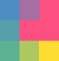

<h1 align="left">
  <a href="https://alineofco.de"></a>
</h1>

## Lines

This is the lines project which is currently in progress.
[Here's a link to the current working version](https://drawlin.es)!

## Background

Lines is a gestural code editor that runs in the browser - for mobile. It is built with React and uses Canvas for rendering. The current functionality allows the user to edit code/text using gestures - similar to vim commands. This inludes:

- Navigating the document
- Deleting a line
- Copying a line to clipboard
- Pasting the clipboard
- Cutting a line


## Currently in development

- Tests

- Combine operations and motions, i.e. delete + 2 lines down, paste + above, move to + line 5

- Importing files from a repository

- Offline mode

- Gesture autocorrection

- Insertion mode. This will require building a parser layer that receives a valid gestures and maintains an internal copy of the code state. This should act as the single source of truth for the gesture and code views.

- A backend for saving files

- Collaborative real-time editing

- Switching to WebGL for rendering


## The Structure 

The application can be broken down into three parts:

- GesturePad
  - GestureInput
    - GestureView
- CodeView
- Header

### GestureInput

Sends user input to the GesturePad by first:

- Listening for user input - onMouseMove/onMouseLeave and onTouchMove/onTouchEnd
- Transforming the input to grid points

It also sends each input to GestureView

### GesturePad

The GesturePad validates user input by:

- Keeping track of the running pattern of grid points
- Getting the path from the pattern - a series of directions - i.e. 

    ```[{1,1}, {2,1}] === "Right"```

- Matching this path against a valid gesture list
- Saving this to the context state

### GestureInput

Renders both the current input and valid gestures in the GestureView - a 9x9 grid. The render involves:

- Drawing the current position
- Fading expired positions until white
- Drawing a matched gesture - a line running through it's center distinguishes it from just an input

### CodeEditor

Responsible for taking gestures and deciding what the CodeEditorView should be displaying.  

- Gestures -> Commands that need to executed by the Editor

### CodeEdtiorView

Uses CodeMirror - an browser code editor library.

- Renders the CodeMirror component
- Marks the cursor position
- Highlights the line selected for an operation (i.e. delete, cut etc)

### Header

Displays suggested gestures in the form of mini icons using Canvas.


## Running the app

To get the app up and running:

```shell
npm start
```